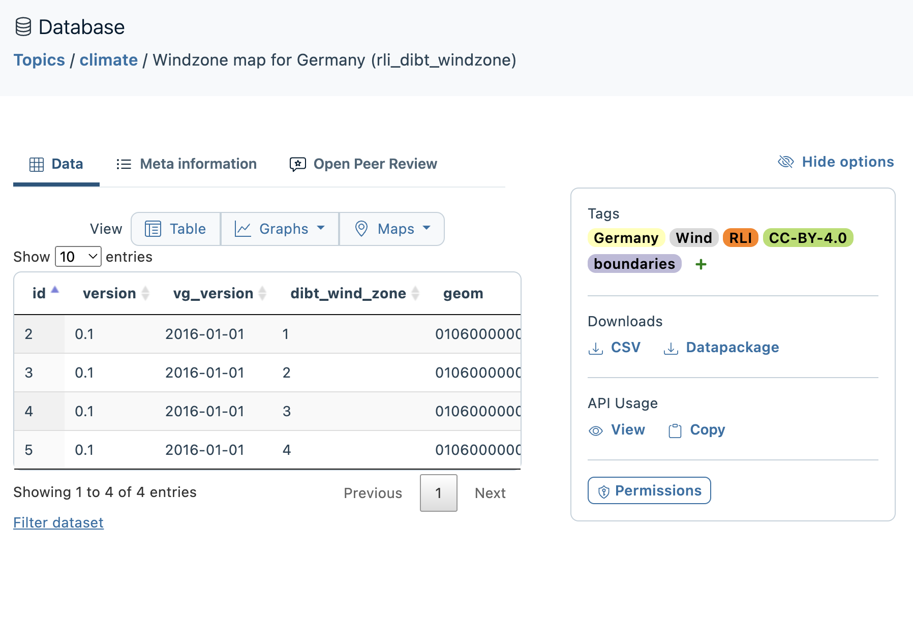

# Metadata Standards

## OEMetadata

[Open Energy Platform](https://openenergyplatform.org/), based in Germany, has a catalog of data that can be used for energy modeling. To ensure reusability of these data, they defined a metadata standard. We chose to use this standard because:

1. It is an extension of a well-defined, simple metadata standard called Data Packages (see below).
2. Additionally, they have published mapping between [OEMetadata and DCAT-AP](https://openenergyplatform.github.io/oemetadata/2.0/metadata/metadata_mappings/), which is the other standard we were seriously considering.
3. The extensions they added align with the fields we required for AEDG, namely: spatial and temporal bounds and more complete documentation of sources.
4. It has built-in connections to their standard vocabulary [Open Energy Ontology](https://openenergy-platform.org/ontology/) for when we are ready to standardize keywords.

### Resources

[oemetadata](https://github.com/OpenEnergyPlatform/oemetadata) is the repository for Open Energy Family metadata", and it contains metadata templates, examples, and schemas". The pip package enables access to the template that is used in this generation package.

Other available tools include:

- an authoring tool: [oemetabuilder](https://openenergyplatform.org/dataedit/oemetabuilder/) which is a fillable form
- a conversion tool: [omi](https://omi.readthedocs.io/en/latest/)
- [tutorials](https://openenergyplatform.github.io/academy/tutorials) on its use
- another tool on the OEP website called [wizard](https://openenergyplatform.org/dataedit/wizard/) which could be the template for a similar feature in AEDG

### Compliance

It is based on existing standards. It is serialized with JSON; from the preamble, you can see that its schema follows http://json-schema.org/draft-07/schema# (from 2018). The [oemetadata GitHub repo](https://github.com/OpenEnergyPlatform/oemetadata) notes that it is based on the tabular data package specifications and the FAIR principles. It is [compliant with Datapackages 2.0](https://github.com/OpenEnergyPlatform/oemetadata/issues/148) which means it is part of the Frictionless family.

It has recently been refactored to follow DCAT-AP structures more closely. There seems to be an effort underway to unify with DCAT-AP, which makes sense since that is the standard for European data catalogs.

Because OEMetadata is compliant with Datapackages, it is possible to download fully described data from their database as a data package. See the download options on this screenshot:



## Data Packages / Frictionless

### Data Package

> [Data Package](https://datapackage.org/) is a standard consisting of a set of simple yet extensible specifications to describe datasets, data files and tabular data. It is a data definition language (DDL) and data API that facilitates findability, accessibility, interoperability, and reusability (FAIR) of data.

There are schemas to define the [Data Package](https://datapackage.org/standard/data-package), each [Data Resource](https://datapackage.org/standard/data-resource) in the package, and a [Table Schema](https://datapackage.org/standard/table-schema) to use with CSV files.

There is lots of activity around this standard:

- The Data Package (v2) standard was released on June 26, 2024
- The [Kaggle machine learning platform](https://github.com/Kaggle/kaggle-api/wiki/Dataset-Metadata) uses it.
- Catalyst Cooperative describes their [PUDL data](https://github.com/search?q=repo%3Acatalyst-cooperative%2Fpudl%20frictionless&type=code) with it.
- there is a [tutorial notebook in CoLab](https://colab.research.google.com/github/frictionlessdata/frictionless-py/blob/v4/site/docs/tutorials/notebooks/frictionless-RDM-workflows.ipynb)
- Ian and Jesse tried it in the Alaska Energy Trends Report

### Frictionless

Frictionless is a framework for managing data packages that has been implemented in many languages:

- For Python, [frictionless-py](https://framework.frictionlessdata.io/) includes a library of tools and a CLI with a nicely complete set of [GitHub documentation](https://framework.frictionlessdata.io/).
- If you prefer R, there is an [frictionless R package](https://docs.ropensci.org/frictionless/) too with an [R tutorial](https://cran.r-project.org/web/packages/frictionless/vignettes/frictionless.html).
- On the display side, there are [Javascript React components](https://github.com/frictionlessdata/datapackage-render-js)
- Datopian also has [a Data Catalog](https://datahub.io/) that seems to run via GitHub. Users can [publish](https://datahub.io/publish) or downloads Data Packages.

### Validation

One advantage of Frictionless is its ability to validate your files against the published schema.  Here is how you can do it in Python:

``` python
from frictionless import validate

report = validate('table.csv', schema='schema.json')
print(report)

# or
package.validate()
```

There is also a command line interface which you would invoke with:

``` shell
% frictionless validate capital-invalid.csv
```

Note: OEMetadata includes an example test of validating against their schema, which has been integrated into this package.
